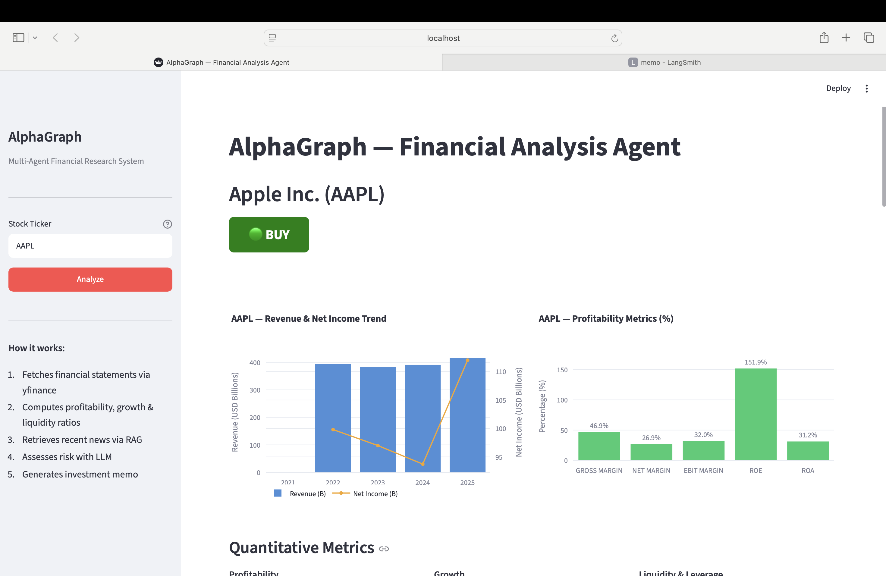
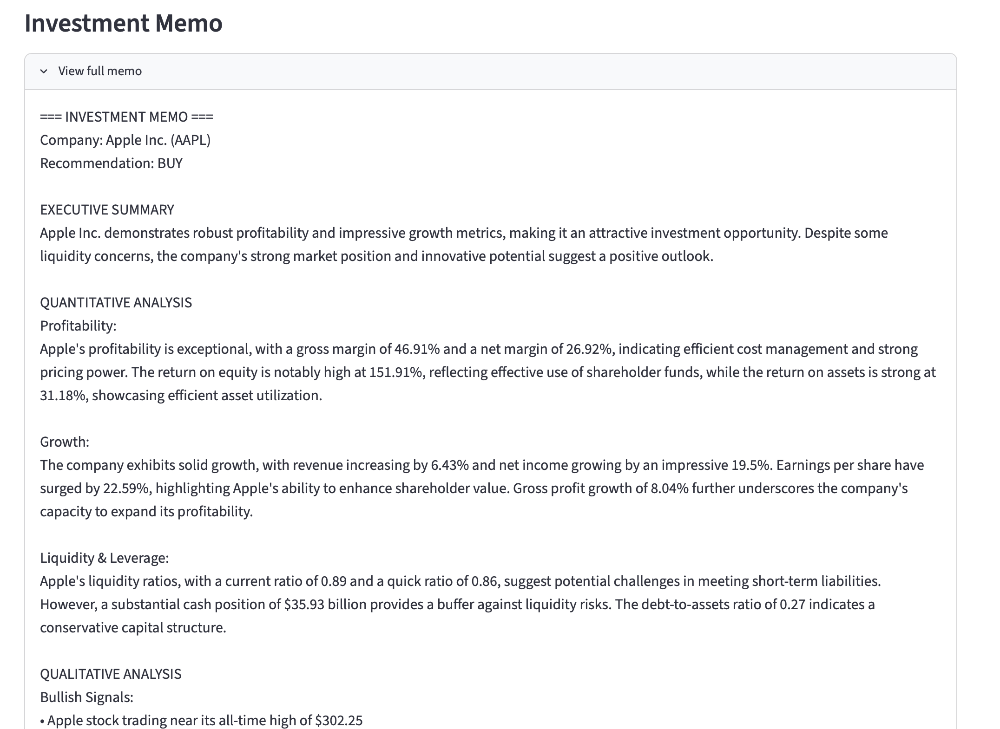
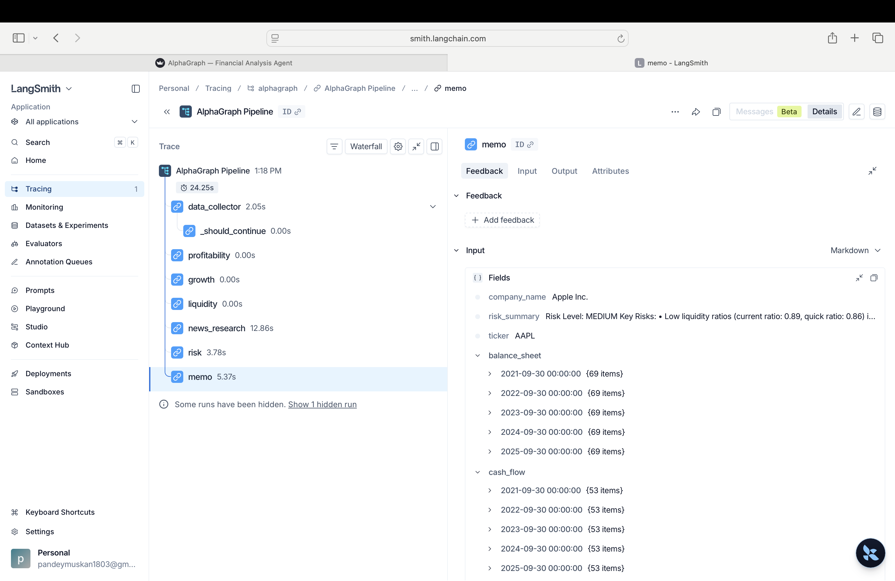

# 📈 AlphaGraph — Multi-Agent Financial Research System

**AlphaGraph** is a multi-agent financial research system built with **LangGraph**. Given a stock ticker, a pipeline of seven specialized agents fetches financial statements (yfinance), computes profitability/growth/liquidity ratios in pure Python, retrieves recent news via a **FAISS RAG index**, assesses risk with an LLM, and generates a professional investment memo with a **Buy / Hold / Sell** recommendation — all viewable in a Streamlit dashboard.

> From ticker to investment memo — quantitative ratios + news RAG + LLM reasoning, orchestrated with LangGraph.

---

## Screenshots

| Streamlit dashboard | Investment memo |
|---|---|
|  |  |

> Add your own images to `docs/` (`app-ui.png`, `memo.png`). The LangSmith trace is shown in the [Observability](#observability-langsmith) section below.

---

## Why this design

The core idea: **keep the numbers deterministic and let the LLM handle only the narrative.**

- The financial figures and ratios are computed in **pure Python** — fully tested, reproducible, and never hallucinated.
- The LLM is used only for **qualitative reasoning**: extracting news signals, assessing risk, and writing the memo.

This separation means the quantitative output is trustworthy, and the AI adds the analyst-style narrative on top.

---

## Architecture

Seven nodes wired into a LangGraph `StateGraph`. A single shared `FinancialState` flows through all of them — nodes communicate only through that state, never directly.

```
[ticker]
   │
   ▼
┌─────────────────────┐
│ 1. data_collector   │  yfinance → income stmt, balance sheet, cash flow
└─────────┬───────────┘
          │  (conditional edge: bail out on invalid ticker)
          ▼
┌─────────────────────┐
│ 2. profitability    │  ROE, ROA, gross/net/EBIT margins      ┐
├─────────────────────┤                                        │
│ 3. growth           │  revenue / EPS / profit growth (YoY)   │ pure Python
├─────────────────────┤                                        │ (no LLM)
│ 4. liquidity        │  current / quick ratio, debt, cash     ┘
├─────────────────────┤
│ 5. news_research    │  FAISS RAG → bullish / bearish signals  ┐
├─────────────────────┤                                         │ LLM
│ 6. risk_agent       │  synthesizes risk level + key risks     │ (OpenAI)
├─────────────────────┤                                         │
│ 7. memo_writer      │  structured memo + BUY/HOLD/SELL        ┘
└─────────┬───────────┘
          ▼
[investment memo + recommendation]
```

| Stage | Source | LLM? |
|---|---|---|
| Financial statements | yfinance | No |
| Profitability / growth / liquidity ratios | Python | No |
| News signals | FAISS RAG + GPT-4o-mini | Yes |
| Risk assessment | GPT-4o-mini | Yes |
| Final memo + recommendation | GPT-4o | Yes |

---

## Tech stack

| Layer | Library |
|---|---|
| Agent orchestration | `langgraph`, `langchain` |
| LLM | `openai` |
| Financial data | `yfinance` |
| RAG embeddings | `sentence-transformers` (`all-MiniLM-L6-v2`) |
| Vector store | `faiss-cpu` |
| Observability | `langsmith` (optional) |
| Agent interop | `mcp` (optional MCP server) |
| Visualization | `plotly` |
| UI | `streamlit` |
| Tests / lint | `pytest`, `ruff` |

---

## Setup

```bash
# 1. Create a virtual environment (Python 3.11 or 3.12 recommended)
python3.12 -m venv .venv
source .venv/bin/activate

# 2. Install dependencies
pip install -r requirements.txt

# 3. Configure environment
cp .env.example .env
# Edit .env and add your OPENAI_API_KEY (and NEWS_API_KEY to build the index)
```

### Build the news index (one time)

The FAISS news index powers the RAG step (Node 5). Build it once with your NewsAPI key:

```bash
python -m alphagraph.rag.build_index --tickers AAPL MSFT GOOGL TSLA NVDA AMZN META
```

This embeds recent news and writes the index to `data/faiss_index/`. The running app does **not** rebuild it — commit it to the repo so deployments work out of the box.

---

## Usage

### Streamlit app

```bash
streamlit run app.py
```

Enter a ticker (e.g. `AAPL`, `AMZN`, `NVDA`) and click **Analyze**. Common company names ("Amazon", "Tesla") are auto-mapped to their tickers.

### CLI

```bash
python -m alphagraph.pipeline --ticker AAPL
```

### As an MCP server

Expose AlphaGraph as tools any MCP client (Claude Desktop, Cursor) can call:

```bash
python -m alphagraph.mcp_server
```

Tools provided: `analyze_stock`, `get_financial_metrics`, `get_news_signals`, `get_recommendation`.

Claude Desktop config (`~/Library/Application Support/Claude/claude_desktop_config.json`):

```json
{
  "mcpServers": {
    "alphagraph": {
      "command": "/absolute/path/to/.venv/bin/python",
      "args": ["-m", "alphagraph.mcp_server"],
      "cwd": "/absolute/path/to/Financial_analyst"
    }
  }
}
```

---

## Observability (LangSmith)

Tracing is optional and requires no code changes — just set environment variables in `.env`:

```bash
LANGCHAIN_TRACING_V2=true
LANGCHAIN_API_KEY=ls__your_key
LANGCHAIN_PROJECT=alphagraph
```

Every pipeline run then appears in the [LangSmith](https://smith.langchain.com) dashboard with per-node latency and token usage.



The trace makes the architecture's core design decision visible at a glance: the pure-Python analysis nodes (`profitability`, `growth`, `liquidity`) run in **0.00s** with no LLM call, while the LLM nodes (`news_research`, `risk`, `memo`) account for nearly all the latency. The `_should_continue` step is the conditional edge that aborts early on invalid tickers.

---

## Tests & linting

```bash
pytest                 # 11 tests, no API keys required (covers the pure-Python nodes)
pytest -v              # verbose
ruff check .           # lint
ruff format .          # format
```

---

## Project structure

```
alphagraph/
├── state.py              # FinancialState TypedDict — the shared state
├── graph.py              # build_graph(): wires the 7 nodes
├── pipeline.py           # CLI entry point + run()
├── mcp_server.py         # MCP server exposing the pipeline as tools
├── nodes/
│   ├── data_collector.py # Node 1 — yfinance fetch
│   ├── profitability.py  # Node 2 — pure Python
│   ├── growth.py         # Node 3 — pure Python
│   ├── liquidity.py      # Node 4 — pure Python
│   ├── news_research.py  # Node 5 — RAG + LLM
│   ├── risk_agent.py     # Node 6 — LLM
│   └── memo_writer.py    # Node 7 — LLM
└── rag/
    ├── build_index.py    # builds the FAISS news index
    └── retriever.py      # ticker-aware retrieval
app.py                    # Streamlit UI
tests/test_agents.py      # unit tests for the pure-Python nodes
data/faiss_index/         # pre-built news index
```

---

## Deploying to Streamlit Community Cloud

1. Push the repo to GitHub (include `data/faiss_index/`; keep `.env` gitignored).
2. At [share.streamlit.io](https://share.streamlit.io), connect the repo and set the main file to `app.py`.
3. Add `OPENAI_API_KEY` under **Settings → Secrets** (NewsAPI is only needed locally to build the index).

---

## Scope & limitations

- Works for **publicly traded companies** with financial statements — including web3-exposed stocks like `COIN`, `MSTR`, `MARA`, `RIOT`.
- Does **not** work for raw cryptocurrencies (`BTC-USD`, `ETH-USD`) — they have no income statement or balance sheet, so the ratio nodes have nothing to compute.
- The news index is static (pre-built); tickers not included at build time return no news signals (handled gracefully, not an error).
- Not investment advice — a portfolio/educational project.
